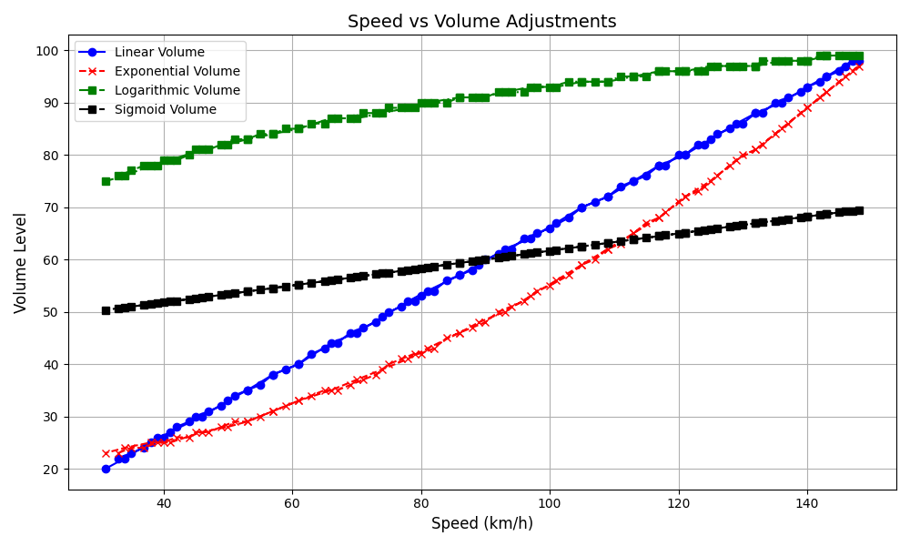

# 🎵 Speed-Sensitive Volume Plugin for Assetto Corsa
# ⚠️ WE HIGHLY RECOMMAND USING [THIS EXTERNAL VERSION](https://github.com/1Developpeur/speed-sensitive-volume-external)
**Automatically adjust music volume based on your car's speed**  
*A modern solution for immersive racing experiences*

  
*Volume response curves for different algorithms (simulated data, max speed 150 km/h)*

## 🚀 Features
- 📊 4 Volume adjustment algorithms
- 🎚️ Real-time speed/volume visualization
- ⚙️ In-game configuration menu
- 🔍 Automatic music app detection
- 🛠️ Customizable speed/volume ranges
- ✅ Supports Spotify, YouTube Music, VLC, etc.

## 📦 Installation

### Setup
1. Download the project and place the folder SpeedSensitive_Volume in your game directory (e.g., `C:\Program Files (x86)\Steam\steamapps\common\assettocorsa\`) and inside the folder apps\python\
(`C:\Program Files (x86)\Steam\steamapps\common\assettocorsa\apps\python\`)

Should looks like this:
```bash
assettocorsa/
└── apps/
    └── python/
        └── SpeedSensitive_Volume/
            ├── SoundVolumeView.exe
            ├── config.ini
            └── SpeedSensitive_Volume.py
```

2. Enable the app in the game settings:
- `Settings → General → Python Apps → SpeedSensitive_Volume`

## 🛠️ Configuration

You can edit `config.ini`:
```ini
[SpeedSensitiveVolume]
min_speed = 30 ; Volume starts increasing above this speed (km/h)
max_speed = 250 ; Full volume at this speed
min_volume = 20 ; Minimum volume (0-100)
max_volume = 100 ; Maximum volume (0-100)
scan_delay = 500 ; Refresh interval in milliseconds, do not change (can significatly increase CPU usage)
```
or configure in in-game menu

## 🧮 Algorithms

### 1. Linear Interpolation
```python3
volume = min_vol + (speed - min_speed)/(max_speed - min_speed) * (max_vol - min_vol)
```

- 🟢 Simple proportional adjustment
- 🔴 Sudden changes at speed thresholds

### 2. Exponential Scaling

```python3
volume = min_vol + (speed² / max_speed²) * (max_vol - min_vol)
```

- 🟢 Gradual increase at low speeds
- 🔴 Rapid increase at higher speeds

### 3. Logarithmic Scaling

```python3
volume = min_vol + log(speed+1)/log(max_speed+1) * (max_vol - min_vol)
```

- 🟢 Smooth transition across range
- 🔴 Requires speed > 0

### 4. Sigmoid Curve

```python3
volume = min_vol + (max_vol - min_vol) / (1 + exp(-(speed - min_speed)/(max_speed - min_speed) - 0.5))
```

- 🟢 Most natural sound transition
- 🔴 Complex calculation

*To switch algorithms, modify the `calculate_volume()` function in the code*

## 🖥️ GUI Overview


1. **Music App Detection**: Shows currently detected players
2. **Real-time Indicators**: Speed/volume progress bars
3. **Configuration Menu**: 
   - Set speed/volume thresholds
   - Save/reset preferences
   - Enable/disable plugin

## ❓ FAQ

**Q: My music app isn't detected**  
A: 1. Click "Scan music apps"  
   2. Add your app name to `music_apps` list in code

**Q: Volume isn't changing**  
- Verify SoundVolumeView.exe location
- Run AC as Administrator
- Check app name spelling (case-sensitive)

**Q: Best algorithm for city driving?**  
We recommend *Exponential* for smooth volume transitions in stop-and-go traffic

## 📜 License
MIT License - See [LICENSE](LICENSE)

## 🙏 Acknowledgements
- NirSoft for SoundVolumeView
- AC Python community for SDK support
- Inspired by real-world car audio systems
